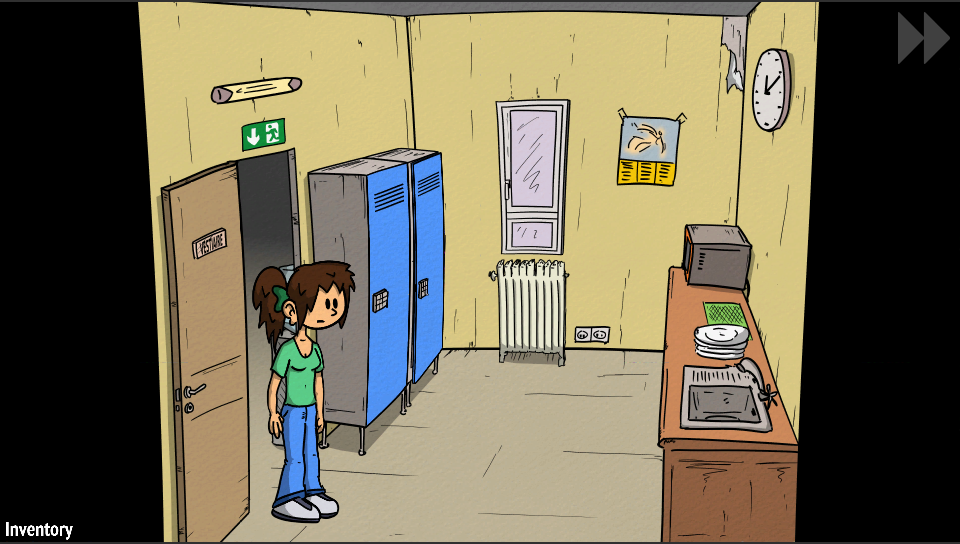

# Superfluous Returnz Vita

<p align="center"></p>

This is a wrapper/port of <b>Superfluous Returnz</b> for the *PS Vita*.

The port works by loading the official Android ARMv7 executable in memory, resolving its imports with native functions and patching it in order to properly run.
By doing so, it's basically as if we emulate a minimalist Android environment in which we run natively the executable as it is.

## Disclaimer

As of v.0.5, this port can properly allow to play solely the Demo version of the game. The full game will boot but eventually will run out of mem making the game unbeatable.

## Changelog

### v0.5

- Initial Release.

## Setup Instructions (For End Users) - General Part

- Install [kubridge](https://github.com/TheOfficialFloW/kubridge/releases/) and [FdFix](https://github.com/TheOfficialFloW/FdFix/releases/) by copying `kubridge.skprx` and `fd_fix.skprx` to your taiHEN plugins folder (usually `ux0:tai`) and adding two entries to your `config.txt` under `*KERNEL`:
  
```
  *KERNEL
  ux0:tai/kubridge.skprx
  ux0:tai/fd_fix.skprx
```

**Note** Don't install fd_fix.skprx if you're using rePatch plugin

- **Optional**: Install [PSVshell](https://github.com/Electry/PSVshell/releases) to overclock your device to 500Mhz.
- Install `libshacccg.suprx`, if you don't have it already, by following [this guide](https://samilops2.gitbook.io/vita-troubleshooting-guide/shader-compiler/extract-libshacccg.suprx).
- Install the vpk from Release tab.
- Obtain your copy of *Superfluous Returnz* legally for Android in form of an `.apk` file and an `.obb` file (The Demo version works as well but beware it's formed by only an apk file).

## Setup Instructions (For End Users) - Full Game Part
- Before proceeding, be sure to have read the Disclaimer paragraph of this README.
- Open the apk with your zip explorer and extract the files `libmain.so`, `libc++_shared.so`, `libyaml.so` and `liblz4.so` from the `lib/armeabi-v7a` folder to `ux0:data/sosage`. 
- Download the `patcher.zip` archive from Release tab and extract it on your computer in a folder.
- Extract the `data` folder from the `.obb` inside the same folder where you extracted `patcher.zip` and rename it `data_orig`.
- With a command line instance, run `SCAP data_orig/ . -d` and wait for it to finish (It will work in background).
- Once finished, run `patcher.exe` and wait for it to finish.
- Create an `assets` folder inside `ux0:data/sosage` and create inside it another folder named `data` so that you end up having `ux0:data/sosage/assets/data`.
- Place `pvr` folder inside `uxo:data/sosage/assets`.
- Grab the `images` folder from inside `patched` folder and place it inside `ux0:data/sosage/assets/data`.
- Grab `fonts`, `sounds` and `data` folder from the same folder where you extracted `patcher.zip` and place it inside `ux0:data/sosage/assets/data`.

## Setup Instructions (For End Users) - Demo Part
- Open the apk with your zip explorer and extract the files `libmain.so`, `libc++_shared.so`, `libyaml.so` and `liblz4.so` from the `lib/armeabi-v7a` folder to `ux0:data/sosage`. 
- Extract the `assets` folder from the `.apk` inside `ux0:data/sosage`.

## Build Instructions (For Developers)

In order to build the loader, you'll need a [vitasdk](https://github.com/vitasdk) build fully compiled with softfp usage.  
You can find a precompiled version here: https://github.com/vitasdk/buildscripts/actions/runs/1102643776.  
Additionally, you'll need these libraries to be compiled as well with `-mfloat-abi=softfp` added to their CFLAGS:

- [SDL2_vitagl](https://github.com/Northfear/SDL/tree/vitagl)

- [libmathneon](https://github.com/Rinnegatamante/math-neon)

  - ```bash
    make install
    ```

- [vitaShaRK](https://github.com/Rinnegatamante/vitaShaRK)

  - ```bash
    make install
    ```

- [kubridge](https://github.com/TheOfficialFloW/kubridge)

  - ```bash
    mkdir build && cd build
    cmake .. && make install
    ```

- [vitaGL](https://github.com/Rinnegatamante/vitaGL)

  - ````bash
    make SOFTFP_ABI=1 HAVE_WRAPPED_ALLOCATORS=1 install
    ````

After all these requirements are met, you can compile the loader with the following commands:

```bash
mkdir build && cd build
cmake .. && make
```

## Credits

- TheFloW for the original .so loader.
- CatoTheYounger for the screenshots and for testing the homebrew.
- fgsfds for providing a precompiled Windows build for SCAP utility.
- Northfear for the SDL2 fork with vitaGL as backend.
